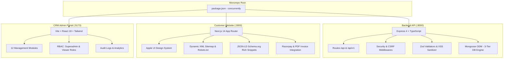

# 🚩 आरंभ (Aarambha) Tours & Travels — Full-Stack Monorepo

> **Production-Grade MERN/Next.js Monorepo**  
> Luxury Pilgrimage Tours, Bus Rentals & Self-Drive Fleet Management Portal

---

## 🏛️ Architecture Overview



---

## ⚡ Quick Start (Local Development)

### 1. Prerequisites
- **Node.js**: v18+ (v20+ recommended)
- **npm**: v9+

### 2. Setup & Installation
```bash
# Clone the repository
git clone https://github.com/your-org/Aarambha-Travels.git
cd Aarambha-Travels-main

# Install dependencies across all packages
npm run install:all
```

### 3. Configure Environment Files
Templates are ready in each directory:
- `backend/.env` (configured for dev with in-memory DB fallback)
- `frontend/website/.env.local`
- `frontend/crm/.env`

### 4. Run Everything with One Command
```bash
npm run dev
```

| Service | Local URL | Description |
|---|---|---|
| **Backend API** | [http://localhost:8000](http://localhost:8000) | Express API & `/api/health` |
| **Customer Website** | [http://localhost:3000](http://localhost:3000) | Next.js 14 Customer Portal |
| **CRM Admin Portal** | [http://localhost:5173](http://localhost:5173) | Vite Admin Panel |

---

## 🔑 Default Seed Credentials

When starting in development mode, the database is automatically seeded:

| Role | Email | Password | Permissions |
|---|---|---|---|
| **Superadmin** | `admin@aarambhatravels.in` | `Admin@123` | Full Read & Write access |
| **Superadmin (Backup)** | `admin2@aarambhatravels.in` | `Admin@123` | Full Read & Write access |
| **Viewer** | `viewer1@aarambhatravels.in` | `Viewer@123` | Read-only access |

---

## 🛡️ Security & Defense Architecture

- **Password Security**: Cryptographic `bcrypt` (12 salt rounds) with constant-time comparison.
- **Session Security**: 24h JWT tokens with active `tokenVersion` revocation on password reset.
- **Account Lockout**: 5 failed login attempts trigger an automatic 15-minute lockout.
- **Rate Limiting**: Sliding-window rate limiters across general traffic, login, and booking submissions.
- **CSRF Protection**: Double-submit cookie & origin verification for state-modifying requests.
- **Injection Defense**: Deep recursive HTML/script stripping on all request payloads before Zod schema validation.
- **Helmet-Grade Headers**: Content-Security-Policy (CSP), Strict-Transport-Security (HSTS), X-Frame-Options, X-Content-Type-Options.
- **Audit Trails**: Security and authentication events are logged to the database with 90-day automatic retention TTL.

---

## 🎨 Apple UI Design System

The frontends implement the **Apple UI Design System**:
- **Typography**: `-apple-system, BlinkMacSystemFont, "SF Pro Display", "SF Pro Text", sans-serif` with negative tracking (`-0.022em` headlines, `-0.011em` body).
- **8pt Base Grid**: Multiples of 8px across paddings, margins, and layout gaps.
- **Corner Radii**: Buttons `12px`, Cards/Modals `20px`, Badges `8px`.
- **44px Touch Targets**: Minimum 44px clickable touch height across all interactive elements.
- **Semantic Glassmorphism**: `rgba(28, 28, 30, 0.7)` with `backdrop-filter: blur(20px) saturate(180%)`.
- **Natural Spring Motion**: `cubic-bezier(0.25, 0.1, 0.25, 1)` with `scale(1.02)` hover and `scale(0.96)` active.

---

## 🔍 SEO & Generative Engine Optimization (GEO)

- **Dynamic Sitemap**: [http://localhost:3000/sitemap.xml](http://localhost:3000/sitemap.xml)
- **Robots Directives**: [http://localhost:3000/robots.txt](http://localhost:3000/robots.txt)
- **AI Knowledge Manifest (GEO)**: [http://localhost:3000/llms.txt](http://localhost:3000/llms.txt)
- **AI Crawler Permissions**: [http://localhost:3000/ai.txt](http://localhost:3000/ai.txt)
- **Schema.org Structured Data**: Integrated `TravelAgency`, `TouristTrip`, `Offer`, and `AggregateRating` JSON-LD schemas.

---

## 🧪 Automated Testing

Run the automated backend test suite:
```bash
cd backend
npm test
```

Tests cover:
1. Deep XSS & HTML injection stripping
2. Auth Zod schema validation
3. Negative validator checks
4. Cryptographic password hashing (bcrypt 12 rounds)
5. CSRF token generation
6. Payment HMAC-SHA256 signature verification

---

## 🐳 Docker Deployment

To spin up a local MongoDB container:
```bash
docker-compose up -d
```

---

## 📜 License & Ownership
Copyright © 2026 **आरंभ (Aarambha) Tours & Travels**. All rights reserved.
