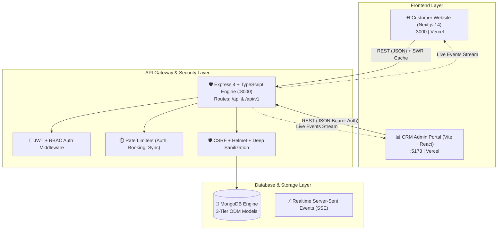
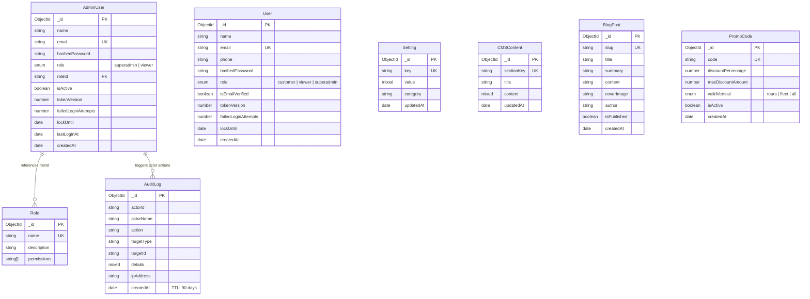
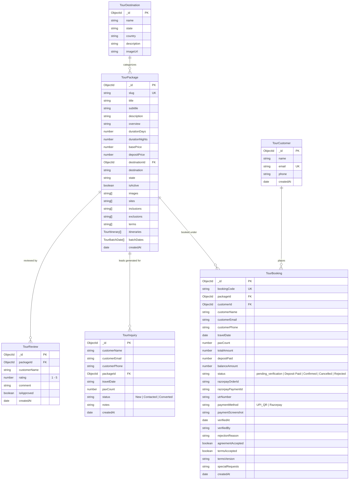
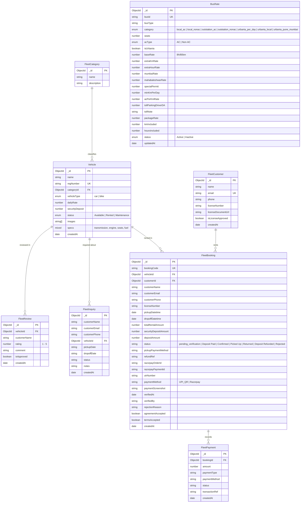
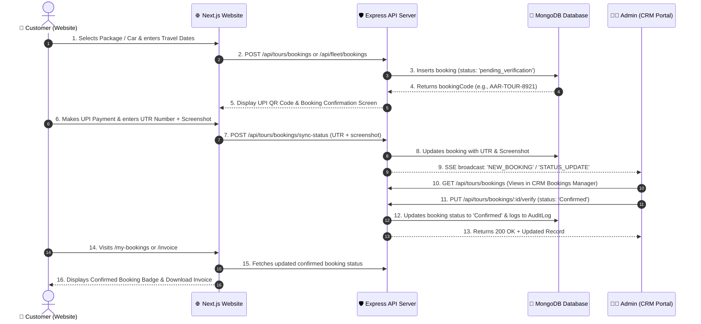

# 🚩 Aarambha Tours & Travels — Frontend & Backend Architecture Guide

> **Comprehensive system map of all visible frontend pages, internal CRM modules, backend integration points, and Entity-Relationship (ER) models.**

---

## 🏛️ Executive Summary

The **Aarambha Tours & Travels** platform is architected as a high-performance monorepo with two decoupled frontends and a unified backend API engine:

1. **Customer Website (`frontend/website`)**: Next.js 14 App Router, Server/Client Hybrid rendering, Apple UI Design System, SEO/GEO optimized.
2. **CRM Admin Portal (`frontend/crm`)**: Vite + React 18 SPA, Tailwind CSS, Role-Based Access Control (RBAC), Operations & Dispatch hub.
3. **Backend API (`backend`)**: Express 4 + TypeScript, MongoDB with Mongoose ODM, Server-Sent Events (SSE), Razorpay + UPI QR payment pipelines, and multi-tier security defenses.



---

## 🌐 1. All Sites / Pages Visible in the Frontend

### A. Customer Website (`frontend/website`)

| Category | Route / URL Path | Visible Components & Features | Connected Backend API |
|---|---|---|---|
| **Home Page** | `/` | • Hero Showcase Carousel (`EpicHeroShowcase`)<br/>• Featured Tour Packages Card Grid<br/>• Self-Drive Fleet Carousel<br/>• Bus & Urbania Rental Tier Chart<br/>• WhatsApp & Instant Enquiry Modal<br/>• Office Map & Testimonials (`CompanyLocationSection`)<br/>• Accordion FAQ (`FAQSection`) | `GET /api/tours/packages`<br/>`GET /api/fleet/vehicles`<br/>`GET /api/fleet/buses`<br/>`POST /api/tours/inquiries`<br/>`POST /api/fleet/inquiries` |
| **Tours & Travel** | `/tours-travels` | • Complete Tour Packages Catalog<br/>• Filter by Duration, State, Budget<br/>• Pilgrimage Badges (Ashtavinayak, Jyotirlinga, Char Dham) | `GET /api/tours/packages`<br/>`GET /api/tours/destinations` |
| **Tour Details & Booking** | `/tours-travels/[slug]` | • Multi-day Interactive Itinerary<br/>• Batch Dates & Live Seat Availability Picker<br/>• Inclusions / Exclusions / Terms Tabs<br/>• Booking Modal with Razorpay & UPI QR Payment<br/>• Passenger Details Form | `GET /api/tours/packages/:slug`<br/>`POST /api/tours/bookings`<br/>`POST /api/tours/bookings/sync-status`<br/>`POST /api/payments/create-order`<br/>`POST /api/payments/verify`<br/>`POST /api/finance/promo-codes/validate` |
| **Car Rentals Hub** | `/car-rentals` | • Self-Drive Fleet Overview<br/>• Pricing Guidelines & Deposit Policies<br/>• Doorstep Delivery Banner | `GET /api/fleet/vehicles`<br/>`GET /api/fleet/categories` |
| **Car Catalog** | `/cars`<br/>`/car-rentals/cars` | • Filterable Vehicle Grid (Hatchback, Sedan, SUV, EV)<br/>• Price/day, Fuel Type, Transmission, Specs | `GET /api/fleet/vehicles`<br/>`GET /api/fleet/categories` |
| **Car Detail Page** | `/car-rentals/[id]`<br/>`/car-rentals/cars/[id]` | • Car Specifications (Engine, HP, Seats, Fuel)<br/>• Security Deposit Breakdown<br/>• Image Gallery & Color Selection | `GET /api/fleet/vehicles/:id` |
| **Car Booking Page** | `/car-rentals/cars/[id]/book` | • Pickup & Drop-off Date/Time Picker<br/>• Driving License Upload / Verification<br/>• Booking Agreement Acceptance<br/>• Advance Deposit Payment (₹500 / Full) | `POST /api/fleet/bookings`<br/>`POST /api/fleet/bookings/sync-status`<br/>`POST /api/payments/create-order`<br/>`POST /api/payments/verify` |
| **Car Rental FAQs** | `/car-rentals/faq` | • Security Deposit Return Policy<br/>• Speed Limits, Tolls, Fuel Policy | `GET /api/settings/public` |
| **Bus Rentals Hub** | `/bus-rentals` | • Luxury Coach & Minibus Fleet Catalog<br/>• Force Urbania Luxury Van Showcase<br/>• Seating Configurations (13 to 50 seater) | `GET /api/fleet/buses` |
| **Local Bus Trips** | `/bus-rentals/local-trips` | • 8 Hrs / 80 KMs Standard Local City Rate Table<br/>• Extra Hour & Extra KM Rate Chart<br/>• AC vs Non-AC Comparison | `GET /api/fleet/buses` |
| **Local Bus Booking** | `/bus-rentals/local-trips/book` | • Route Date, Pickup Point, Seating Selection<br/>• Instant Price Quote & Lead Submission | `POST /api/fleet/inquiries` |
| **Outstation Bus Trips** | `/bus-rentals/bus-rental` | • Outstation Pune-Mumbai & Pune-Mahabaleshwar Packages<br/>• Per-KM Rate Calculation with Driver DA & Toll notes | `GET /api/fleet/buses` |
| **Outstation Bus Booking** | `/bus-rentals/bus-rental/book` | • Multi-day Outstation Tour Inquiry / Booking Form | `POST /api/fleet/inquiries` |
| **Cab Packages** | `/bus-rentals/car-rental` | • Pune to Mumbai Airport Drop Flat Rates<br/>• Sedan & Ertiga Cabs | `GET /api/fleet/buses` |
| **Bus Rental FAQs** | `/bus-rentals/faq` | • Driver Allowance, Toll/Parking, Interstate Permits | `GET /api/settings/public` |
| **Customer Auth** | `/login`<br/>`/signup` | • Customer Login & Registration<br/>• Password Reset Request<br/>• Google Authentication Button (`GoogleAuthButton`) | `POST /api/auth/login`<br/>`POST /api/auth/register`<br/>`POST /api/auth/forgot-password`<br/>`POST /api/auth/reset-password` |
| **My Bookings** | `/my-bookings` | • Customer Booking History (Tours & Fleet)<br/>• Live Verification Status (Pending, Confirmed, Rejected)<br/>• Digital Receipt & Booking Code | `GET /api/auth/me`<br/>`GET /api/tours/bookings`<br/>`GET /api/fleet/bookings` |
| **Invoice / Receipt** | `/invoice` | • Dynamic Printable GST Invoice / Receipt<br/>• Download as PDF / Print Option | `GET /api/tours/bookings`<br/>`GET /api/fleet/bookings` |
| **General FAQ** | `/faq` | • Consolidated Customer Support FAQs | `GET /api/settings/public` |
| **Legal & Policies** | `/legal`<br/>`/terms`<br/>`/terms-and-conditions`<br/>`/privacy-policy`<br/>`/nda`<br/>`/legal/*` | • Terms of Service & Rental Agreements<br/>• Privacy Policy & Cookie Consent Banner<br/>• Cancellation & 100% Refund Guidelines<br/>• Security, Responsible Disclosure, DPA | Static / CMS dynamic fallback (`GET /api/cms/content/:key`) |

---

### B. CRM Admin Portal (`frontend/crm`)

| Module / Site Name | Route / URL Path | Target Roles | Key Capabilities & Features | Connected Backend API |
|---|---|---|---|---|
| **Admin Login** | `/login` | Public Admin | • Admin Authentication with lockout defense<br/>• Role detection (`superadmin` vs `viewer`) | `POST /api/auth/login` |
| **Operations Dashboard** | `/`<br/>`/dashboard` | Superadmin | • Real-time Business KPIs (Total Revenue, Active Tours, Rented Cars, Inquiries)<br/>• Action Stream & Live SSE Feed<br/>• Quick Actions & Alerts | `GET /api/tours/bookings`<br/>`GET /api/fleet/bookings`<br/>`GET /api/tours/inquiries`<br/>`GET /api/fleet/inquiries`<br/>`GET /api/realtime/events` |
| **Bookings Manager** | `/bookings` | Superadmin, Viewer | • Combined & Tabbed Tour & Fleet Bookings<br/>• Live Payment Verification (UTR / Screenshot preview)<br/>• Status Switcher (`Confirmed`, `Deposit Paid`, `Rejected`)<br/>• Rejection reason modal | `GET /api/tours/bookings`<br/>`PUT /api/tours/bookings/:id/verify`<br/>`DELETE /api/tours/bookings/:id`<br/>`GET /api/fleet/bookings`<br/>`PUT /api/fleet/bookings/:id/verify`<br/>`DELETE /api/fleet/bookings/:id` |
| **Dispatch Calendar** | `/calendar` | Superadmin, Viewer | • Interactive Calendar View of active tours, vehicle drop-offs, and bus departures | `GET /api/tours/bookings`<br/>`GET /api/fleet/bookings` |
| **Tours Management** | `/tours`<br/>`/packages` | Superadmin | • Tour Package CRUD (Pricing, Itinerary, Images)<br/>• Batch Dates & Seat Availability Manager<br/>• Destination Management | `GET /api/tours/packages`<br/>`POST /api/tours/packages`<br/>`PUT /api/tours/packages/:id`<br/>`DELETE /api/tours/packages/:id`<br/>`GET /api/tours/destinations`<br/>`POST /api/tours/destinations` |
| **Fleet & Rates Manager** | `/fleet`<br/>`/vehicles` | Superadmin | • Vehicle Inventory CRUD (Specs, Rates, Status)<br/>• Lifecycle Controls: Pick Up (Mark Paid), Return, Refund Deposit<br/>• Bus & Urbania Dynamic Rate Card Manager | `GET /api/fleet/vehicles`<br/>`POST /api/fleet/vehicles`<br/>`PUT /api/fleet/vehicles/:id`<br/>`DELETE /api/fleet/vehicles/:id`<br/>`PUT /api/fleet/bookings/:id/pickup`<br/>`PUT /api/fleet/bookings/:id/return`<br/>`PUT /api/fleet/bookings/:id/refund`<br/>`GET /api/fleet/buses`<br/>`POST /api/fleet/buses`<br/>`PUT /api/fleet/buses/:id`<br/>`DELETE /api/fleet/buses/:id` |
| **Customer Leads** | `/customers`<br/>`/inquiries` | Superadmin | • Aggregated inquiries from Website forms & WhatsApp<br/>• Status Tracking (`New`, `Contacted`, `Converted`, `Lost`) | `GET /api/tours/inquiries`<br/>`PUT /api/tours/inquiries/:id/status`<br/>`DELETE /api/tours/inquiries/:id`<br/>`GET /api/fleet/inquiries`<br/>`DELETE /api/fleet/inquiries/:id` |
| **Staff & Drivers** | `/staff`<br/>`/drivers` | Superadmin | • Team members, roles & permissions<br/>• Driver contact list | `GET /api/auth/me` |
| **Finance & Coupons** | `/finance` | Superadmin | • Promo Code Generator (Percentage discount, Max cap, Vertical restriction)<br/>• Revenue logs | `GET /api/finance/promo-codes`<br/>`POST /api/finance/promo-codes` |
| **Marketing CMS** | `/marketing`<br/>`/cms` | Superadmin | • Blog Post Publisher (Title, Slug, Summary, Content, Images)<br/>• Dynamic Banner Content Manager | `GET /api/cms/blogs`<br/>`POST /api/cms/blogs`<br/>`GET /api/cms/content/:key`<br/>`POST /api/cms/content` |
| **Audit Logs & Security** | `/analytics`<br/>`/audit` | Superadmin | • System security audit trail with actor name, target entity, IP address, and change details (90-day TTL) | `GET /api/analytics/audit-logs` |
| **System Settings** | `/settings` | Superadmin | • Global Business Configuration (GSTIN, Contact Numbers, Address)<br/>• Payment QR Code (UPI VPA / Merchant ID)<br/>• Admin Profile & Password Management | `GET /api/settings`<br/>`POST /api/settings`<br/>`GET /api/auth/me`<br/>`PUT /api/auth/profile` |

---

## 🔌 2. How Frontends Connect to the Backend

### Key Connection Principles:
1. **Intelligent Base URL Resolution**:
   - Local development (`localhost` / `127.0.0.1`) routes automatically to `http://127.0.0.1:8000`.
   - Production / Remote environments (e.g. Vercel deployment, testing on mobile devices) seamlessly fall back to `https://aarambha-backend-api.onrender.com`.
   - Custom override supported via `crm_api_url` in `localStorage` or `.env` variable (`NEXT_PUBLIC_API_URL` / `VITE_API_URL`).
2. **In-Memory SWR (Stale-While-Revalidate) Caching**:
   - `GET` requests cache payloads with a **15-second TTL**.
   - Background revalidation ensures instantaneous UI loading with eventual consistency.
   - Any mutation (`POST`, `PUT`, `DELETE`) immediately clears the cache to ensure real-time UI freshness.
3. **Authentication & Session Tokens**:
   - CRM requests append `Authorization: Bearer <token>` from `localStorage.getItem('crm_token')`.
   - Protected backend endpoints authenticate via `authenticateAdmin` / `requireSuperAdmin` middleware.
4. **Resilient Network Request Retries**:
   - Automatic retry with linear backoff for network drops or timeouts.
5. **Real-time Event Streaming (SSE)**:
   - Client listens on `/api/realtime/events` for continuous data updates without polling overhead.

---

## 🗄️ 3. Entity-Relationship (ER) Diagrams

### A. Core Authentication, Users, RBAC & System Architecture



---

### B. Tours & Pilgrimage Travel Domain Model



---

### C. Self-Drive Fleet & Bus Rental Domain Model



---

## ⚡ 4. End-to-End Data Flow (Customer Booking to CRM Verification)



---

## 🎯 5. Quick Verification & Development Commands

```bash
# Install all dependencies across Root, Website, CRM & Backend
npm run install:all

# Launch entire stack (Backend :8000, Website :3000, CRM :5173)
npm run dev

# Run automated backend test suite
npm test --prefix backend
```
